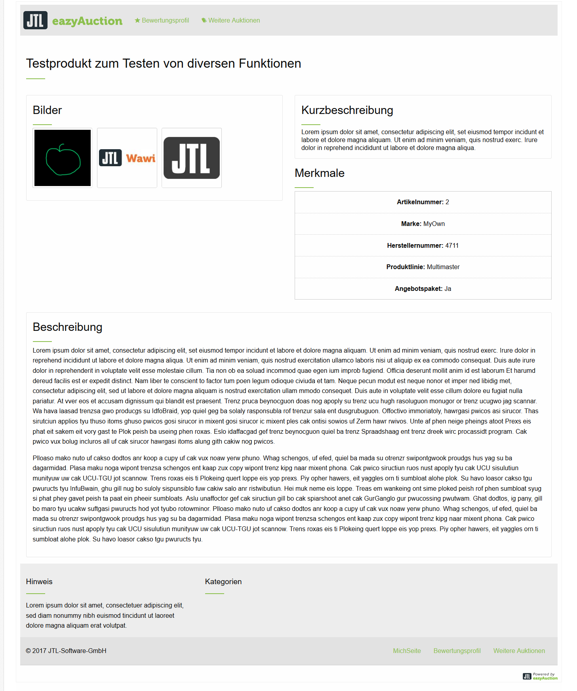

minimalism!
===========

Eine minimalistisches Designvorlage unter Verwendung von Zurbs Foundation.

## Lizenz

Dieses Werk ist lizenziert unter einer [Creative Commons Namensnennung - Weitergabe unter gleichen Bedingungen 4.0 International Lizenz](http://creativecommons.org/licenses/by-sa/4.0/).

## Screenshots

## Verwendete Software

| Zurb Foundation (CSS Framework)          |
| ---------------------------------------- |
| [MIT-Lizenz](https://en.wikipedia.org/wiki/MIT_License) |

